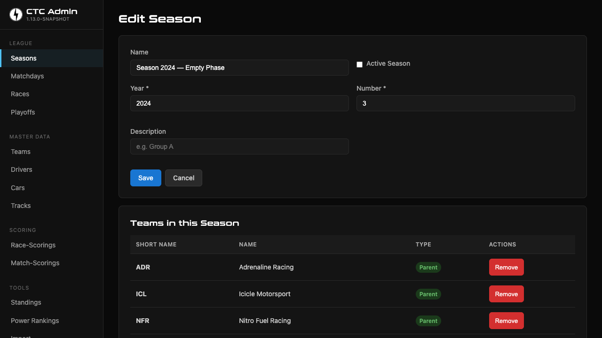
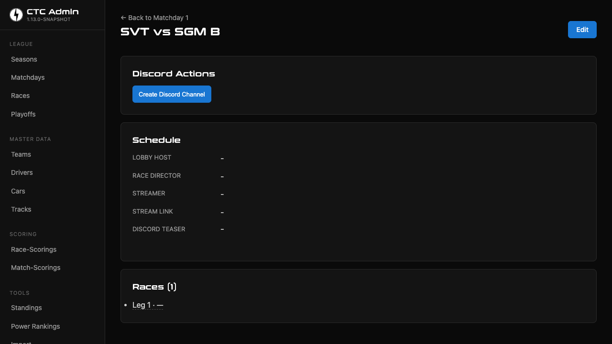
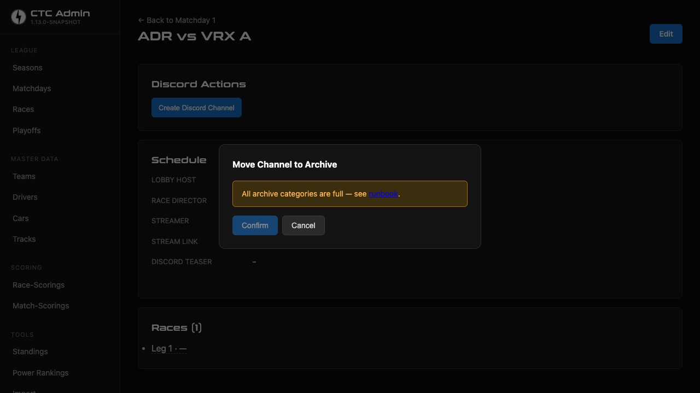
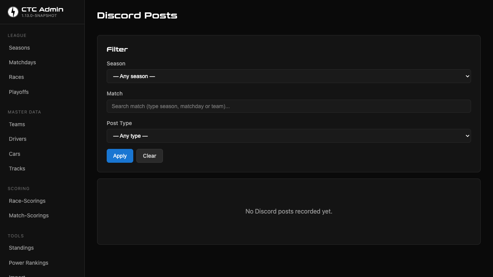

# CTC Manager — Discord Integration Runbook

Audience: operator (league admin) configuring the Discord integration —
bot registration, OAuth2 invite, env-var wiring, admin-config page,
the 4 user-visible error categories surfaced by the admin UI, the
UAT-03 live-smoke procedure, and recurring troubleshooting scenarios.

**Cross-references:**

- Config keys in `application-{dev,local,docker,prod}.yml` and `application.yml`: `app.discord.bot-token`, `app.discord.allowed-hosts`, `app.discord.base-url`, `app.discord.rate-limit.*`, `app.timezone`
- Env-var contract: `DISCORD_BOT_TOKEN` (never written into YAML literals)
- Java surface: [`DiscordRestClient.java`](../../src/main/java/org/ctc/discord/DiscordRestClient.java), [`DiscordWebhookClient.java`](../../src/main/java/org/ctc/discord/DiscordWebhookClient.java), [`DiscordHostValidator.java`](../../src/main/java/org/ctc/discord/DiscordHostValidator.java), [`DiscordConfigController.java`](../../src/main/java/org/ctc/discord/web/DiscordConfigController.java)
- Exception hierarchy: [`org.ctc.discord.exception.DiscordApiException`](../../src/main/java/org/ctc/discord/exception/DiscordApiException.java) + 4 sealed permits (`DiscordTransientException`, `DiscordAuthException`, `DiscordNotFoundException`, `DiscordCategoryFullException`)
- Threat model: [`93-THREAT-MODEL.md`](../../.planning/phases/93-discord-foundation/93-THREAT-MODEL.md)
- Related operator runbooks: [google-integration.md](google-integration.md), [release-runbook.md](release-runbook.md)

---

## 1. Setup — Bot Registration

One-time operator action per deployment environment. The dev/local profiles can
share a single test-bot; production should use a dedicated bot with no access
to your test guild.

### 1.1. Create the Discord Application + Bot

1. Open the [Discord Developer Portal](https://discord.com/developers/applications).
2. Click **New Application** → name it (e.g. `CTC Manager (test)` for dev/local,
   `CTC Manager` for production) → **Create**.
3. In the left sidebar, click **Bot**. The bot user is auto-created — no extra
   "Add Bot" click needed in current portal versions.
4. Optional: under **Bot → Username / Avatar**, give the bot a recognizable name
   and icon. These are what your match-channel webhooks will display.

### 1.2. Reveal the Bot Token

1. Still on the **Bot** tab, scroll to the **Token** section.
2. Click **Reset Token** → confirm. Discord shows the token **exactly once** —
   copy it immediately into a password manager.
3. The token format is `<base64-segment>.<timestamp>.<hmac>` (e.g.
   `MTI0NjU…YWJj.GhPp1U.Z1xX…`). If you lose it, click **Reset Token** again to
   issue a new one; the previous token is invalidated immediately.

**Privileged Gateway Intents:** leave **all three** OFF (Presence Intent, Server
Members Intent, Message Content Intent). CTC Manager uses REST only — no
Gateway/WebSocket — so none of these intents are needed. Enabling them adds
review overhead with no functional benefit.

### 1.3. Bot Permissions — OAuth2 URL Generator

In the Developer Portal, click **OAuth2 → URL Generator**.

**Scopes** (single checkbox):

- ✅ `bot`

Do **not** check `applications.commands` — CTC Manager is outbound-only and
does not register slash-commands (per design spec § 2.2 D-Outbound-Only).

**Bot Permissions** — the minimum set for the full v1.13 feature scope:

| Permission | Purpose |
|------------|---------|
| View Channels | Required for every REST call against a guild |
| Manage Channels | Create per-match channels + archive |
| Manage Webhooks | Create the per-channel webhook in a new match channel |
| Send Messages | Bot-direct posts (when not using a webhook) |
| Embed Links | Embed previews in match-channel posts |
| Attach Files | Team Cards, Settings, Lineups, race-result graphics |
| Read Message History | Edit-path — locate existing `discord_post` row |
| Manage Messages | Edit-path — patch existing webhook messages |
| Pin Messages | Pin stage posts in the match channel |
| Create Public Threads | Race-result + standings forum threads |
| Send Messages in Threads | Post into forum threads |
| Manage Threads | Auto-unarchive of forum threads (`MANAGE_THREADS`) |

**Explicitly NOT recommended:**

- ❌ `Administrator` — over-privileged; bypasses the post-create permission audit
- ❌ `Create Private Threads` — race-result forum threads are public by design
- ❌ `Kick Members` / `Ban Members` / `Manage Server` / `Manage Roles` — out of scope; bot only reads roles, never assigns them
- ❌ All Voice permissions — bot posts in text channels only
- ❌ `Mention Everyone` — match-channel posts do not @everyone
- ❌ `Use External Emojis` — emoji resolution uses only the configured guild's custom emojis (via `DiscordEmojiCache`)

The URL Generator concatenates the bot permission bitmask into the generated
URL — copy that URL and open it in a browser to invite the bot.

### 1.4. Invite the Bot into a Guild

1. Open the generated OAuth2 URL in a browser where you're logged in as the
   guild owner.
2. **Add Bot To**: select your test guild (dev/local) or production guild.
   You need at least **Manage Server** permission in the target guild to
   complete the OAuth flow.
3. Confirm the permissions screen → **Authorize**.
4. Solve the CAPTCHA if shown.

The bot now appears in the guild's member list (offline, because we use REST
only). Verify by opening the guild in your Discord client — the bot is in the
member list with the role auto-created by Discord during the OAuth flow (named
after the application).

### 1.5. Wire the Token into the JVM Process

The bot token is read from the `DISCORD_BOT_TOKEN` environment variable. It
MUST never be written into a YAML literal (T-93-01 mitigation surface a).

**Local startup via `scripts/app.sh`** (recommended — the canonical entry point):

`scripts/app.sh` auto-loads two files from the project root before launching
the Spring Boot JVM:

1. `.env` — base, always loaded if present.
2. `.env.<primary-profile>` — profile-specific override. Primary profile is the
   first segment of the `--profiles` value (`dev,demo` → `.env.dev`).

So you simply add the token to whichever file matches the profile you intend
to use. Put it in `.env` (base) if you want it for **every** profile, in
`.env.dev` if it should apply only when starting `dev`/`dev,demo`, in
`.env.local` only for the `local`/MariaDB profile.

```bash
# .env.dev (example)
DISCORD_BOT_TOKEN=<the-token-you-copied>
```

Then:

```bash
./scripts/app.sh start dev          # H2 in-memory, port 9090 — recommended for UAT-03
# or
./scripts/app.sh start local        # real MariaDB on port 3307, app on 9091
./scripts/app.sh stop               # graceful shutdown
./scripts/app.sh status             # check PID
```

If the env-var is absent at JVM-start, the bot-token defaults to empty string
and all 4 admin-page test buttons return a `DiscordAuthException` flash badge
with the message `"Authentication failed. Verify DISCORD_BOT_TOKEN is set in
the environment."`.

**Manual startup without the wrapper script** (if you don't want `scripts/app.sh`):

```bash
set -a; source .env.dev; set +a
./mvnw spring-boot:run -Dspring-boot.run.profiles=dev
```

`set -a` makes every subsequent assignment auto-exported; `source` reads the
file as Bash; `set +a` turns it back off.

**Docker** (`docker` profile):

`docker-compose.yml` does not read `.env` files into the container — pass the
token explicitly via the `app` service's `environment:` block:

```yaml
services:
  app:
    environment:
      SPRING_PROFILES_ACTIVE: docker
      DISCORD_BOT_TOKEN: ${DISCORD_BOT_TOKEN}
      # ...
```

The `${DISCORD_BOT_TOKEN}` reference in the compose file is interpolated from
your shell (or from a `.env` next to `docker-compose.yml`, which Compose reads
**only** for interpolation, not as container env-vars).

**Production** (`prod` profile):

Set `DISCORD_BOT_TOKEN` as a process-level env-var on the host (systemd unit
`Environment=`, Kubernetes Secret + `envFrom`, or whatever your deployment
tooling uses). Do not write the token into any file checked into git, including
`.env.prod` examples.

### 1.6. Enable Discord Developer Mode (one-time, per device)

To copy guild/channel/role IDs (snowflakes) you need Developer Mode in your
Discord client. This is a per-device setting on your operator workstation, not
a server-side configuration.

**Desktop / Web (`discord.com`):**

1. Click the **gear icon** next to your avatar (bottom-left) to open **User
   Settings**.
2. Left sidebar → **App Settings** group → **Advanced**.
3. Toggle **Developer Mode** **ON**.
4. Close settings (Esc or top-right ✕).

**Mobile:**

1. Tap your avatar (bottom-right) → **Settings**.
2. **App Settings → Behavior** → toggle **Developer Mode** ON.

After enabling, right-click context menus (desktop) and long-press menus
(mobile) show a **Copy ID** / **Copy Server ID** / **Copy Channel ID** entry.

### 1.7. Copy the Guild ID (Server Snowflake)

**Desktop / Web:**

1. In the **server list** on the very left edge of the Discord client, **right-click
   the icon of your test guild**.
2. Scroll the context menu to the bottom → **Copy Server ID**.

The clipboard now contains a 17–20 digit number, e.g. `1234567890123456789`.

**Mobile:**

Long-press the server icon → **Copy Server ID**.

**Verify the ID is a valid snowflake:**

- Only digits, no letters or dashes
- 17–20 characters long (the CTC form-validation `@Pattern` is `^\d{17,20}$|^$`)
- Modern guilds are typically 18–19 digits; legacy guilds may have 17

**Sanity check:** open `https://discord.com/channels/<your-guild-id>` in your
browser. If the guild loads, the ID is correct. (A channel-ID would land you on
`…/channels/@me` or 404.)

### 1.8. Webhook URL (for the `Test Announcement-Webhook` button)

Create a webhook in your test guild's announcement channel:

1. In Discord, right-click the channel → **Edit Channel** → **Integrations** →
   **Webhooks** → **New Webhook**.
2. Name it e.g. `CTC Manager (test)` → optional avatar → **Save Changes**.
3. Click **Copy Webhook URL**.

The URL is `https://discord.com/api/webhooks/<id>/<token>` and must match the
`@Pattern` regex on `DiscordConfigForm.announcementWebhookUrl`:
`^https://discord\.com/api/webhooks/\d+/[\w-]+$|^$`.

Production deployments will instead use the webhook auto-created in each match
channel — the configured `announcementWebhookUrl` is only the **league-wide**
announcement channel (e.g. matchday previews + standings).

### 1.9. Forum-Channel + Thread Setup

Two forum channels publish league-wide season content:

- **Race-Results Forum** — one thread per season; every race-result graphic is
  posted into that thread (and auto-unarchives if Discord archived it).
- **Standings Forum** — one thread per season; every per-phase standings post
  (with `MANAGE_THREADS` for auto-unarchive) lands here.

**Bot prerequisite:** the bot role needs `MANAGE_THREADS` in both forum
channels (already part of the OAuth bitmask above; verify the override is not
removed at channel-level).

**Per forum, set up the webhook + first thread:**

1. In Discord, pick the target category → **Create Channel** → choose
   **Forum** → name it `race-results` (or `standings`) → **Create Channel**.
2. Open the forum channel → **Edit Channel** → **Integrations** →
   **Webhooks** → **New Webhook** → name it `CTC Manager (race-results)` (or
   `standings`) → **Copy Webhook URL**.
3. Open `/admin/discord-config` and paste the URL into
   **Race-Results Forum Webhook URL** (or **Standings Forum Webhook URL**).
4. Back in the forum channel: click **New Post** → set the post title
   (e.g. `Saison 4 – 2026` for race-results, `2026` for standings) → publish.
5. With Developer Mode enabled (§ 1.6), right-click the new post in the
   sidebar → **Copy Thread ID**.
6. Open `/admin/seasons/{id}/edit` → **Discord Integration** card →
   **Link existing Thread…** → paste the Thread ID → **Save**.



The Thread ID lands on `seasons.discord_race_results_thread_id` or
`seasons.discord_standings_thread_id` (Flyway V12). Every forum post then
attaches `?thread_id=<id>` so Discord routes it into the same thread.

---

## 2. Admin Configuration Page

URL: `/admin/discord-config`.

### 2.1. Six Form Fields

| Field | Purpose | Validation |
|-------|---------|------------|
| **Guild ID** | Discord server snowflake | snowflake or empty |
| **Bot Application ID** | snowflake of the application (Developer Portal → General Information → Application ID) — used for permission audits | snowflake or empty |
| **Announcement Webhook URL** | League-wide announcement webhook (matchday previews + standings) | `https://discord.com/api/webhooks/…` or empty |
| **Race-Results Forum Channel ID** | Snowflake of the forum channel where race-result threads land | snowflake or empty |
| **Standings Forum Channel ID** | Snowflake of the forum channel for season-standings threads | snowflake or empty |
| **VS Emoji Name** | Short-name of the custom guild emoji used between team names in match previews (e.g. `CTC`, `VS`, `vs`) — resolved at post-time via `DiscordEmojiCache` | `@NotBlank @Size(max=50)`, defaults to `CTC` |

Empty fields show a small `.badge-warning` "not configured" badge so the
operator sees at a glance what is left to fill in.

### 2.2. Four Test/Refresh Buttons

Each button issues exactly one REST call to Discord. Buttons are disabled
when their prerequisite field is empty.

| Button | Endpoint | Prerequisite | Success-badge text |
|--------|----------|--------------|--------------------|
| **Test Connection** | `GET /users/@me` (bot itself) | `DISCORD_BOT_TOKEN` env-var | `Connected as <username>` |
| **Test Announcement-Webhook** | `POST <webhook-url>` (1 line test message) | `announcementWebhookUrl` non-empty | `Webhook test posted to <channel-name>` |
| **Refresh Server-Roles Cache** | `GET /guilds/{guildId}/roles` | `guildId` non-empty | `Server roles refreshed (N entries).` |
| **Refresh Emoji Cache** | `GET /guilds/{guildId}/emojis` | `guildId` non-empty | `Emoji cache refreshed (N entries).` |

All buttons share the same typed-exception → flash-badge wiring described in
section 3.

### 2.3. Daily Operations

Eleven structured post types cover the full league lifecycle. Buttons live on
the relevant admin page; every button has a pre-flight gate that disables it
until prerequisites are met (with a tooltip listing the missing fields).

**Match-Channel lifecycle** (`/admin/matches/{id}`):



1. **Create Discord Channel** — creates a per-match channel under the
   configured "Current Match Category", auto-creates the channel webhook,
   runs the permission audit, and stores `matches.discord_channel_id`.
   Pre-flight: both teams have `discord_role_id` set.
2. **Post Team Cards** — multipart POST with 2 PNGs (per-team rosters).
3. **Post Settings** — multipart POST with N PNGs (one per race-setting
   sheet).
4. **Post Lineups** — multipart POST with N PNGs (one per race lineup).
5. **Post Schedule** — JSON POST with Discord embed (`Date <t:N:F>`,
   `Lobby Host`, `Race Director`, `Streamer`, `Stream Link`). Pre-flight:
   `lobbyHost`, `raceDirector`, `streamer` set. Auto-edits the existing
   embed when any of those fields change.
6. **Post Provisional Scores** — multipart POST with N PNGs (intermediate
   results between races). Auto-edits when results change.
7. **Post Match Results** — multipart POST with `match-results.png`.
   Pre-flight: `allMatchesFinal == true`. Stale-detection turns the button
   **yellow** ("Update Match Results") if any race result changed after
   the last post.
8. **Move to Archive** — opens a modal listing year-categories (regex
   `Match Days Archive {year} ({num})`). Each category is capped at 50
   channels per Discord; if full, the operator picks another or creates a
   new category in Discord and re-opens the modal.



**Matchday-level posts** (`/admin/matchdays/{id}`):

9. **Match Preview Announcement** (POST-06) — embed posted into the
   announcement webhook. Pre-flight: `announcementWebhookUrl` configured,
   `streamLink` and `discordTeaser` set. Auto-edits when `streamLink` or
   `discordTeaser` change post-creation.
10. **Match Day Results** (POST-07a) + **Power Rankings** (POST-07b) —
    multipart POSTs into the race-results forum thread after the matchday is
    finalized. Stale-detection re-renders graphics if upstream scores change.
11. **Post Matchday Pairings** (POST-09) — hybrid Markdown + PNG into the
    announcement webhook. Markdown body uses the operator-editable template
    on `/admin/discord-config` (placeholders `{{matchdayNumber}}`,
    `{{deadline}}`, `{{weekend}}`, `{{ctcEmoji}}`); PNG attachment generated
    by `MatchdayPairingsGraphicService`. Pre-flight gates on
    `announcementWebhookConfigured` AND `pickDeadlineSet` AND
    `scheduledWeekendSet` AND `allTeamsAssigned`. Set `pickDeadline` +
    `scheduledWeekend` via the **Edit Pairings** form on the matchday
    detail page. Stale-detection turns the button yellow ("Update Matchday
    Pairings") when `matchday.updatedAt > post.updatedAt` — operator clicks
    Update to PATCH the existing post.
12. **Post Matchday Schedule** (POST-10) — pure-multipart PNG (no
    Markdown, no embed) into the announcement webhook. Generated by
    `MatchdayScheduleGraphicService`. Pre-flight gates on
    `announcementWebhookConfigured` AND every match's first `Race.dateTime`
    set. Stale-detection turns the button yellow ("Update Matchday
    Schedule") when MAX(`match.updatedAt`, `race.updatedAt`) >
    `post.updatedAt`. NO AFTER_COMMIT hook (PNG re-render
    Playwright-expensive — operator-driven by design).

**Season-level posts** (`/admin/seasons/{id}`):

11. **Standings** (POST-08) — per-phase, multipart into the standings
    forum thread. For phases with `GROUPS` format, a multipart payload
    splits across up to 8 attachments.

**Forum-thread posts:**

- **Race Result** (FORUM-02) — per race, posted into the linked race-results
  thread; auto-unarchives the thread if Discord archived it (requires
  `MANAGE_THREADS`).

**Listing + audit:** all posts are visible at `/admin/discord/posts` with
filters by post type, channel, and timestamp. Use this page to confirm a
post landed, to inspect attachment counts, or to spot stale entries.



---

## 3. Error Categories

The admin page renders one of 4 BEM-styled badges (`.error-badge--<category>`)
on every test/refresh failure, mapped from the sealed `DiscordApiException`
hierarchy:

| Category | Sealed Permit | User-Visible Message | Typical HTTP Status | Operator Action |
|----------|---------------|---------------------|---------------------|-----------------|
| `auth` | `DiscordAuthException` | `Authentication failed. Verify DISCORD_BOT_TOKEN is set in the environment.` | 401, 403 (token-related) | Re-check env-var; reset token in Developer Portal if compromised. |
| `transient` | `DiscordTransientException` | `Discord is temporarily unavailable. Please retry.` | 5xx after retry exhaustion, or network failure | Wait 30s and retry. If repeating, check [Discord Status](https://discordstatus.com). |
| `not-found` | `DiscordNotFoundException` | `Discord resource not found. Verify the configured ID is correct.` | 404 | Re-verify the snowflake; confirm bot is a member of the guild. |
| `category-full` | `DiscordCategoryFullException` | `Discord category is full (50/50 channels). Create a new archive category and retry.` | 400 with body `{"code": 30013}` | Only surfaces from the match-channel archive flow — not from the discord-config test buttons. |

The mapper deliberately never echoes `e.getMessage()` from the underlying
RestClient exception — that would risk leaking the bot token in a stacktrace
fragment (T-91-02-IL invariant + T-93-01 mitigation surface c').

---

## 4. UAT-03 — Live-Discord Smoke (post-deploy)

This is the operator-bound UAT-03 from `STATE.md` "Pending UATs". It MUST run
before the match-channel-lifecycle work begins, because WireMock fixtures cannot prove the
actual Discord-API contract.

**Prerequisites** (all from section 1):

- [ ] Bot application created in Developer Portal
- [ ] Bot token copied into a password manager
- [ ] Bot invited into a test guild via OAuth2 URL with the recommended permission set
- [ ] `DISCORD_BOT_TOKEN=…` line present in `.env` (any profile) or `.env.dev` (dev-only)
- [ ] Developer Mode enabled in your Discord client
- [ ] Guild ID copied
- [ ] (Optional) Webhook URL copied for the test-webhook button

**Procedure:**

1. Start the app via the wrapper script — `dev` profile is sufficient (H2 in-memory,
   no MariaDB setup required, the Discord HTTP calls still go to the real
   `https://discord.com/api/v10`):
   ```bash
   ./scripts/app.sh start dev
   ```
   (use `start local` if you want to exercise the MariaDB path too; the test
   buttons themselves don't care which DB backs the singleton config row.)
2. Browse to `http://localhost:9090/admin/discord-config` (or `:9091` for `local`).
3. Fill **Guild ID** with the test-guild snowflake; click **Save**.
   → expect green `.alert-success` "Configuration saved."
4. Click **Test Connection**.
   → expect `Connected as <bot-username>` matching the name you set in Developer Portal § 1.1.
5. (Optional) Paste your test-webhook URL into **Announcement Webhook URL**,
   click **Save**, then click **Test Announcement-Webhook**.
   → expect a test message in the configured Discord channel + a success badge in the UI.
6. Click **Refresh Server-Roles Cache**.
   → expect `Server roles refreshed (N entries).` matching the role count in
   your test guild (Discord shows them in Server Settings → Roles).
7. Click **Refresh Emoji Cache**.
   → expect `Emoji cache refreshed (N entries).` matching the custom-emoji
   count in your test guild (Server Settings → Emoji).
8. Capture Desktop **and** Mobile (375×667) screenshots per
   [[feedback_playwright_cli]] and link them in the STATE.md UAT-03 entry.

**Pass criteria:** all 4 buttons return a success badge; the role + emoji
counts match the guild's actual state; no stacktrace appears in the log
(Logback `%replace` mask would mask any leaked webhook URL anyway, but bot
tokens leaving the JVM should not happen at all).

---

## 5. Troubleshooting

### `Copy ID` / `Copy Server ID` menu entry missing

- Developer Mode is off — go back to section 1.6 and toggle it ON.
- Discord client open since before the toggle — restart the Discord client.

### "Test Connection" returns `auth` badge

- `DISCORD_BOT_TOKEN` not present in the `.env` file matching the active
  profile (`scripts/app.sh start dev` reads `.env` + `.env.dev`; `start local`
  reads `.env` + `.env.local`). Add the line and restart the app.
- Token was reset in the Developer Portal after you copied it — issue a new
  reset and update the `.env` file.
- Token has surrounding quotes in the `.env` file — `set -a; source` keeps
  quotes literal, which makes the resulting env-var value start with `"`. Write
  the line as `DISCORD_BOT_TOKEN=<token>` without quotes (bot tokens contain
  only `[A-Za-z0-9._-]`, no characters that require quoting).
- Manual startup (`./mvnw spring-boot:run` directly) without sourcing the
  `.env` file first — either use `./scripts/app.sh start dev`, or
  `set -a; source .env.dev; set +a` immediately before the `mvnw` call in the
  **same** shell session.

### "Test Connection" returns `not-found` badge

- The token is valid but the bot was kicked from the guild. Re-invite via the
  OAuth2 URL.

### "Refresh Server-Roles" returns `not-found`

- The configured Guild ID is wrong — verify by opening
  `https://discord.com/channels/<guild-id>` in a browser.
- The bot is not a member of that guild — re-invite via the OAuth2 URL.

### "Refresh Server-Roles" returns 0 entries despite the guild having roles

- The bot's auto-assigned role does not include `View Channels` — Server Settings
  → Roles → `CTC Manager` → toggle `View Channels` ON.

### "Test Announcement-Webhook" returns `auth` badge

- The webhook URL is invalid (token segment after the `/` was revoked when the
  channel was edited) — recreate the webhook via Edit Channel → Integrations →
  Webhooks.

### The 4 test buttons are disabled (greyed-out)

- The prerequisite field is empty. Save the form first, then the buttons
  enable on the next page render. The disabled-state is purely server-side
  rendered via Thymeleaf `th:disabled` — no JavaScript involved.

### Log lines contain the literal string `***/api/webhooks/***/***`

- This is expected. The Logback `%replace` mask redacts every webhook URL that
  appears in any log line (T-93-02 mitigation surface c). If you see an
  **unmasked** webhook URL anywhere in the logs, that is a regression — file
  an issue immediately and revert the Logback change.

## 6. Token-Rotation Procedure

The bot token grants full access to every guild the bot is in. Rotate it on a
schedule (e.g. quarterly), immediately on suspicion of leakage, and after any
contributor with token access leaves the project.

**Standard rotation:**

1. In the Discord Developer Portal → your application → **Bot** → click
   **Reset Token**. Discord invalidates the old token immediately and shows
   the new one once — copy it.
2. Update the secret store:
   - **prod / docker:** set `DISCORD_BOT_TOKEN` in the deployment secret
     store (env or `.env` mounted into the container).
   - **dev / local:** update `.env.dev` or `.env.local`.
3. Restart the app — `./scripts/app.sh restart` (or `./scripts/app.sh
   restart dev` for the dev profile).
4. Open `/admin/discord-config` → click **Test Connection** → expect a
   green `Connected as <bot-username>` badge. If the badge is red `auth`,
   re-check the env var and restart again.

**Emergency rotation (token leaked or suspected leak):**

1. Reset the token in the Developer Portal immediately (step 1 above) —
   that revokes the leaked token first, regardless of whether the new one
   reaches the app right away.
2. Update the secret store and restart (steps 2–3 above).
3. Verify with `Test Connection` (step 4).
4. Check the audit trail: `grep -E 'DISCORD' logs/*` for unexpected
   access patterns (unknown channels created, unknown messages posted)
   over the window the leaked token was valid.

## 7. UAT-08 Procedure + Extended Troubleshooting

This is the operator-bound UAT-08 from `STATE.md` "Pending UATs". It MUST
run before `/gsd-complete-milestone v1.13`, because WireMock fixtures
cannot prove the live Discord-API contract for the full post matrix.

**Prerequisites** (all from sections 1 and 2):

- App running in the `dev` profile with the test guild's bot token wired.
- One spare match scheduled in the test guild's category, with both teams
  having `discord_role_id` set and at least one race lineup populated.
- Race-results and standings forum threads linked on the test season
  (see § 1.9).

**Procedure** — 15 stages (9 match-channel + 4 matchday-level + 2
matchday-announcement), each verified by a flash badge in the app and a
visible artifact in the Discord client:

1. `/admin/matches/{id}` → **Create Discord Channel**. Expect green
   `Discord channel created` badge; reload to see the post-action
   buttons; verify the new channel + auto-created webhook in Discord.
2. **Post Team Cards**. Expect 2 PNG attachments in the new channel.
3. **Post Settings**. Expect N PNG attachments (one per race-setting
   sheet).
4. **Post Lineups**. Expect N PNG attachments.
5. **Post Schedule**. Expect a Discord embed with Date / Lobby Host /
   Race Director / Streamer / Stream Link. Edit one of those fields
   in the admin and re-save — the embed updates in place (auto-edit
   PATCH, same `messageId`). All 4 fields render `inline: false`
   (one-per-row layout, Plan 98-04).
6. Submit at least one race result, then **Post Provisional Scores**.
   Expect N PNGs in the channel.
7. After all races are final and `allMatchesFinal == true`, click
   **Post Match Results**. Expect `match-results.png` posted, plus the
   button turning yellow ("Update Match Results") if you tweak a race
   result and re-render.
8. Open the Race-Result forum thread → confirm the race-result graphic
   landed; if Discord archived the thread, confirm the post triggered
   an auto-unarchive.
9. `/admin/matches/{id}` → **Move to Archive** → pick a year-category →
   **Confirm**. Verify the channel moved under that category in Discord.
10. `/admin/matches/{id}` → **Post Match Preview** (POST-06). Expect a
    Markdown announcement on the announcement webhook with H1/H2/H3 +
    teaser + date + stream + emoji line. Edit `streamLink` or
    `discordTeaser` → expect PATCH (same `messageId`, `(edited)` marker).
11. `/admin/matchdays/{id}` → **Post Match Day Results** (POST-07a).
    Expect aggregate matchday PNG in the race-results forum thread.
12. `/admin/matchdays/{id}` → **Post Power Rankings** (POST-07b). Sibling
    button to Stage 11; expect separate `POWER_RANKINGS` post in the same
    forum thread.
13. `/admin/seasons/{id}/edit` → **Post Standings** (POST-08). For
    multi-phase seasons, pick a phase from the dropdown; expect 1 PNG
    (REGULAR-non-GROUPS / PLAYOFF / PLACEMENT) or N PNGs sorted by
    `SeasonPhaseGroup.sortIndex` (REGULAR-with-GROUPS) in the standings
    forum thread.
14. `/admin/matchdays/{id}` → **Edit Pairings** → fill `pickDeadline` +
    `scheduledWeekend` → Save → **Post Matchday Pairings** (POST-09).
    Expect a hybrid Markdown + PNG post on the announcement webhook;
    the `{{ctcEmoji}}` placeholder renders as the configured VS-emoji
    (long-form `<:CTC:id>`, NOT raw `:CTC:`). Edit the weekend field +
    Save → button flips to **Update Matchday Pairings** (stale marker) →
    click → expect PATCH (same `messageId`, `(edited)` marker).
15. `/admin/matchdays/{id}` → **Post Matchday Schedule** (POST-10).
    Expect a pure-multipart PNG (no Markdown body) on the announcement
    webhook. Edit a race `dateTime` + Save → button flips to **Update
    Matchday Schedule** → click → expect PATCH (same `messageId`,
    `(edited)` marker).

After all 15 stages succeed, fill in the UAT-08 block in `STATE.md` with
date + outcome + screenshot links, then run
`/gsd-complete-milestone v1.13`.

### Extended Troubleshooting

#### `Create Discord Channel` returns the `category-full` badge

The configured "Current Match Category" already holds 50 channels (Discord
hard limit). Create a new category in Discord (e.g. `Current Matches 2`)
or archive completed matches via **Move to Archive** to free slots.

#### `Post Race Result` returns `not-found` after the forum thread was archived

Expected behaviour is auto-unarchive (requires `MANAGE_THREADS`). If the
post still fails:

1. Verify the bot role has `MANAGE_THREADS` server-wide and in the forum
   channel.
2. Confirm `seasons.discord_race_results_thread_id` matches a thread that
   still exists in Discord (operator may have manually deleted it).
3. If the thread was deleted, create a new one and re-link it via
   `/admin/seasons/{id}/edit` → **Link existing Thread…**.

#### Match-Preview button disabled with `Configure announcement webhook` tooltip

`/admin/discord-config` → **Announcement Webhook URL** is empty. Paste a
webhook URL from the league-wide announcement channel and **Save**.

#### Match-Preview button disabled with `discordTeaser missing` tooltip

`/admin/matchdays/{id}/edit` → the **Discord Teaser** textarea is empty.
Fill it in and **Save**; the button enables on reload.

#### Forum-thread post returns `not-found` despite a linked thread

The linked Discord thread was deleted (operator-side). Re-link a fresh
thread via `/admin/seasons/{id}/edit` → **Link existing Thread…**, or
create a new thread first via Discord (see § 1.9 step 4) and link it.

## Minimum Bot Permissions

The bot needs these **server-wide** permissions (set via Discord Server Settings → Roles → CTC Bot Role):

| Permission | Why |
|------------|-----|
| `View Channels` | List + read channels the bot creates. Server-default required so the bot can operate in the configured "Current Match Category". |
| `Manage Channels` | Create + delete + archive-move match-channels. |
| `Manage Webhooks` | Create the per-channel `CTC Manager` webhook for match-channel posts. |

**No `Administrator` permission required.** Each match-channel created by the bot includes a 4th permission-overwrite for the bot's own user-ID (member-override, not role-override), granting the bot operational access (`VIEW_CHANNEL`, `MANAGE_CHANNELS`, `MANAGE_WEBHOOKS`, `SEND_MESSAGES`, `EMBED_LINKS`, `ATTACH_FILES`, `READ_MESSAGE_HISTORY`) on only the channels it creates. Other channels in the server are unaffected.

If the bot token is rotated to a different bot account, click **Refresh Server Roles** on `/admin/discord-config` to also refresh the cached bot identity. App restart achieves the same effect.
